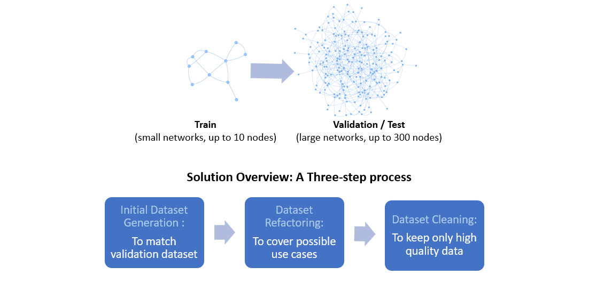

# ITU-ML5G-PS-002-SNOWYOWL-GNNetworking-Challenge2022
This repository contains the code and description of our solution as well as the report and the final presentation slide. 

Graph Neural Networking Challenge 2022: Improving Network Digital Twins through Data-centric AI. For more information about this challenge go to [GNNetChallenge2022](https://bnn.upc.edu/challenge/gnnet2022/).

## Requirements
In order to build and train the model, a working Python 3.9 enviroment is required with the following packages installed:

• tensorflow==2.7.0

• networkx==2.8.1

• numpy==1.21.5


You can install all the required packages with the following pip command:

```pip install tensorflow==2.7 networkx==2.8.1 numpy==1.21.5```

## Proposed Solution
The goal of this work is to produce a training dataset of limited size (at most 100 samples with networks of at most 10 nodes) that should help the given GNN model, i.e. [RouteNet_Fermi](https://github.com/BNN-UPC/GNNetworkingChallenge/tree/2022_DataCentricAI/RouteNet_Fermi), scale effectively to samples of larger networks (50 to 300 nodes) than those seen during training. 

As shown on the figure below, the proposed solution is a three-step process with the goal of generating and keeping only high-quality data samples that cover all possible use cases. A detailed description of our solution can be found [here]().




##  Training and Evaluation
### 1 - GNN model
Download the [GNN model, i.e., RouteNet_Fermi and the datanet API](https://github.com/BNN-UPC/GNNetworkingChallenge/tree/2022_DataCentricAI/RouteNet_Fermi)  made available by the [Barcelona Neural Networking Center](https://bnn.upc.edu/), then save them in a folder named 'RouteNet_Fermi'. The location of this 'RouteNet_Fermi' folder should be the same as all the provided scripts to generate the dataset.

### 2 - Generate Dataset
To generate the dataset: 

• Execute the [dataset_generation.py]() script with ```python dataset_generation.py```. This will generate a first dataset named “dataset_snowyowl”. Once the first dataset is generated, the next step is to clean the dataset.

• Execute the [dataset_cleaning.py]() script with ```python dataset_cleaning.py```. This will clean the first generated dataset and generate the final dataset named “dataset_snowyowl_final”. This dataset will be located in the following path “training_snowyowl/results/”.

Note: For Linux based implementation, give the necessary permissions to the folder before excecuting the [dataset_cleaning.py]() script.

### 2 - Train the model

To train the model, execute the [train.py]() script with ```python train.py```. This will train the model using
the generated dataset and save the model after each epoch in a folder named “modelCheckpoints”.

### 2 - Select the best model
To select the best model, execute the [find_best_model.py]() script with python ```find_best_model.py```. This will find the overall best model and the path of that model with be saved in a file named “Best_model.txt “.

### 2 - Evaluate the model
To evaluate the model, execute the [evaluate.py script]() with ```python evaluate.py```. This will evaluate the best model on the validation set and print the obtained MAPE.

# Credits
This project is the result of the collaboration between:

[Brigitte Jaumard](https://users.encs.concordia.ca/~bjaumard/) - Computer Science and Software Engineering Dpt, Concordia University, Montreal (Qc) Canada

[Junior Momo Ziazet](https://ca.linkedin.com/in/junior-momo-ziazet-710755140) - Computer Science and Software Engineering Dpt, Concordia University, Montreal (Qc) Canada

Charles Boudreau - Computer Science and Software Engineering Dpt, Concordia University, Montreal (Qc) Canada

[Oscar Delgado](https://www.linkedin.com/in/oscar-delgado-180329125) - Computer Science and Software Engineering Dpt, Concordia University, Montreal (Qc) Canada
