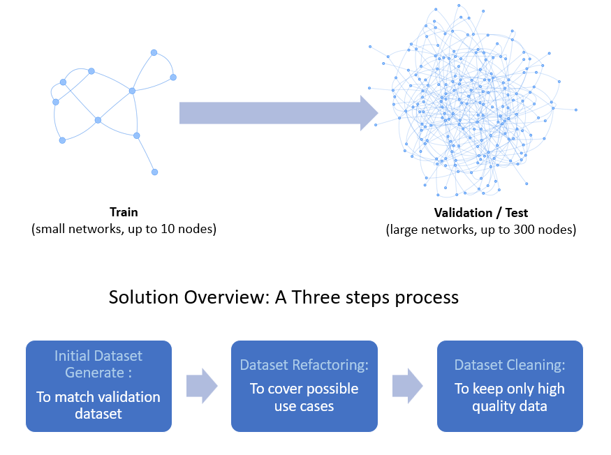

# ITU-ML5G-PS-002-SNOWYOWL-GNNetworking-Challenge2022
This repository contains the code and description of our solution as well as the report and the final presentation slide. 

Graph Neural Networking Challenge 2022: Improving Network Digital Twins through Data-centric AI. For more information about this challenge go to [GNNetChallenge2022](https://bnn.upc.edu/challenge/gnnet2022/).

## Requirements
In order to build and train the model a working Python 3.9 enviroment is required with, at least, the following packages:

• tensorflow==2.7.0

• networkx==2.8.1

• numpy==1.21.5


You can install all the required packages with the following pip command:

```pip install tensorflow==2.7 networkx==2.8.1 numpy==1.21.5```

## Proposed Solution
The goal of this work is to produce a training dataset of limited size (at most 100 samples with networks of at most 10 nodes) that should help the given GNN model, here [RouteNet_Fermi](https://github.com/BNN-UPC/GNNetworkingChallenge/tree/2022_DataCentricAI/RouteNet_Fermi) to scale effectively to samples of larger networks (50 to 300 nodes) than those seen during training. 

The proposed solution is a three-step process, as represented here, with the goal of generating and keeping only high-quality data samples that cover all possible use cases.


